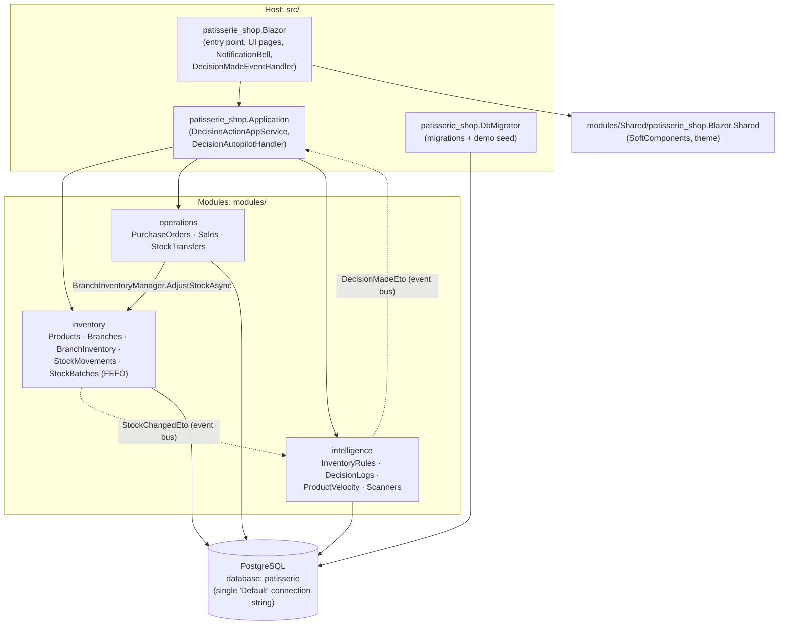
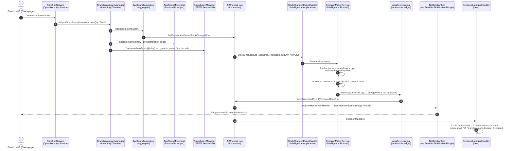
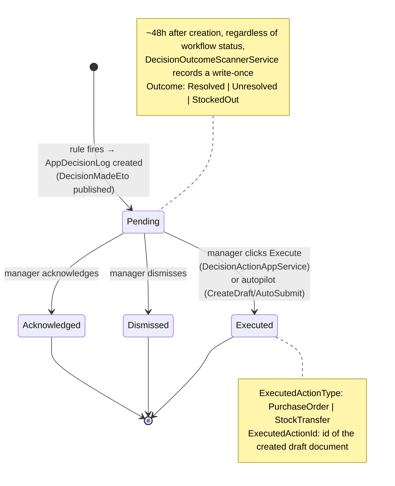

# Architecture

> Smart Multi-Branch Inventory Management System — Rule-Based Inventory Decision Support System.
> ABP Framework v10.1.1 · .NET 10 · Blazor Server · PostgreSQL · EF Core 10.

This document is the technical architecture reference for the thesis. Every type, file,
formula, and constant below is taken directly from the source code (file paths are given
relative to the repository root).

---

## 1. Modular Monolith Layout

The solution is a **modular monolith**: one process, one PostgreSQL database, three
domain modules plus a thin host application. Each module follows Clean/Onion layering
with ABP's rich domain model (entities with private setters and behavior methods,
domain services, custom repositories, thin application services).



Each module has the same internal layering:

| Layer | Contents | Example (inventory) |
|---|---|---|
| `Domain` | Entities, domain services (`*Manager`), repository interfaces | `AppProduct`, `BranchInventoryManager`, `IProductRepository` |
| `Domain.Shared` | ETOs, enums/constant classes, error codes, localization | `StockMovementTypes`, `InventoryErrorCodes` |
| `Application.Contracts` | DTOs, app-service interfaces, permission definitions | `ProductDto`, `IProductAppService`, `InventoryPermissions` |
| `Application` | App-service implementations, event handlers, Mapperly mappers | `ProductAppService`, `StockChangedEventHandler` (intelligence) |
| `EntityFrameworkCore` | DbContext, EF configuration, custom repositories | `InventoryDbContext`, `BranchInventoryRepository` |

Modules never reference each other's entities — **cross-aggregate and cross-module
references are by `Guid` id only**, and cross-module communication is either an app-service
interface call (host orchestration) or a distributed event.

---

## 2. The Event-Driven Core Loop

Everything in the intelligence pipeline starts from a single chokepoint:
`BranchInventoryManager.AdjustStockAsync`
(`modules/inventory/src/Inventory.Domain/BranchInventory/BranchInventoryManager.cs`).
Every sale, purchase receipt, transfer leg, and manual adjustment funnels through it.



Key event types (ETOs):

| ETO | Published by | Consumed by |
|---|---|---|
| `StockChangedEto` | `AppBranchInventory.UpdateStock()` (inside the aggregate) | `StockChangedEventHandler` → `DecisionMakerService` (intelligence) |
| `SaleRecordedEto` | `AppSale` aggregate | operations-side bookkeeping |
| `DecisionMadeEto` | `AppDecisionLog` constructor | `DecisionMadeEventHandler` (UI bell bridge) and `DecisionAutopilotHandler` (autopilot) |

Events are **always published from aggregate methods**, never from application services.

### Real-time vs. scheduled evaluation

`DecisionMakerService.EvaluateAsync` handles only the rule types that can be judged from
a single stock-change event: **LowStock**, **ExcessStock**, and **DaysOfCover**.
**DeadStock**, **TransferSuggestion**, and **ExpiringSoon** need cross-row or
time-based context, so they are evaluated by periodic background scanners (§5).

### Deduplication

Before creating a decision, `DecisionMakerService.TryCreateLogAsync` checks that
(a) the same decision type was not already raised in this evaluation pass, and
(b) **no `Pending` decision of the same `DecisionType` + `ProductId` + `BranchId` already
exists**. The background scanners apply the same pending-dedup (transfer suggestions
dedup on `ProductId` + `SourceBranchId` + `TargetBranchId`). This keeps the decision log
free of alert spam: a standing problem produces exactly one open decision.

---

## 3. Decision Lifecycle

`AppDecisionLog` (`modules/intelligence/src/Intelligence.Domain/Entities/AppDecisionLog.cs`)
is a `CreationAuditedAggregateRoot<Guid>` — an **immutable decision ledger** with exactly
two controlled mutations: a single workflow transition (`TransitionTo`) and a write-once
outcome (`RecordOutcome`).



- **Statuses** (`DecisionLogStatuses`): `Pending`, `Acknowledged`, `Dismissed`, `Executed`.
  The transition is one-shot — `TransitionTo` throws unless the current status is `Pending`.
- **Decision types** (`DecisionTypes`): `LowStockAlert`, `ExcessStockAlert`, `DeadStockFlag`,
  `TransferSuggestion`, `ReorderSuggestion`, `StockoutRisk` (raised by DaysOfCover rules),
  `ExpiryAlert` (raised by ExpiringSoon rules).
- **Outcomes** (`DecisionOutcomes`): `Resolved`, `Unresolved`, `StockedOut` — recorded once,
  ~48 hours after creation (§6).
- Every decision stores its evidence: `RuleId`, `Reasoning` (human-readable sentence),
  `SuggestedAction`, `StockAtEvaluation`, `DaysWithoutSale`, and for transfers
  `SourceBranchId`/`TargetBranchId`.

---

## 4. Rules Engine

### Rule types (`InventoryRuleTypes`)

| RuleType | Threshold field | Meaning | Evaluated by |
|---|---|---|---|
| `LowStock` | `ThresholdValue` (units) | `NewQty < ThresholdValue` | `DecisionMakerService` (real time) |
| `ExcessStock` | `ThresholdValue` (units) | `NewQty > ThresholdValue` | `DecisionMakerService` (real time) |
| `DaysOfCover` | `ThresholdValue` (days) | `NewQty / AvgDailySales30 < ThresholdValue` | `DecisionMakerService` (real time) + `VelocityScannerService` (sweep) |
| `DeadStock` | `ThresholdDays` | days since `LastSoldDate ≥ ThresholdDays` | `DeadStockScannerService` (periodic) |
| `TransferSuggestion` | `ThresholdValue` (units) | one branch low, another in excess | `TransferSuggestionScannerService` (periodic) |
| `ExpiringSoon` | `ThresholdDays` | a live batch expires within `ThresholdDays` | `ExpiryScannerService` (periodic) |

`InventoryRuleTypes.UsesThresholdDays` returns true only for `DeadStock` and `ExpiringSoon`.

### Rule scope matrix

`AppInventoryRule.ProductId` and `BranchId` are both nullable:

| `ProductId` | `BranchId` | Scope |
|---|---|---|
| null | null | Global — all products, all branches |
| set | null | This product in all branches |
| null | set | All products in this branch |
| set | set | This product in this branch |

`RuleScopeMatcher.MatchBestRule`
(`modules/intelligence/src/Intelligence.Application/Decisions/RuleScopeMatcher.cs`)
resolves conflicts with specificity precedence — **exact (product+branch) > product-only >
branch-only > global** — and within the candidate list, higher `Priority` wins (rules are
pre-sorted by `Priority` descending). Example from the seeded rule bank: "Critical Low
Stock Alert" (threshold 2, priority 10) overrides "Global Low Stock Alert" (threshold 5,
priority 0) whenever both match.

### Action modes (`RuleActionModes`) — the autopilot dial

Each rule carries an `ActionMode` that controls what happens the moment one of its
decisions is created (`DecisionAutopilotHandler`,
`src/patisserie_shop.Application/Decisions/DecisionAutopilotHandler.cs`, subscribed to
`DecisionMadeEto`):

| ActionMode | Behavior |
|---|---|
| `SuggestOnly` (default) | Nothing automatic. Decision stays `Pending` for a human. |
| `CreateDraft` | Autopilot immediately runs the same logic as the Execute button: creates the corrective **draft** document and marks the decision `Executed` with a link to it. |
| `AutoSubmit` | Same as `CreateDraft`, then submits the document for approval (PO `Draft → Submitted`). |

Which document gets created depends on the decision type:

| Decision type | Document created on Execute/autopilot |
|---|---|
| `LowStockAlert`, `ReorderSuggestion`, `StockoutRisk` | Draft **purchase order** to the product's default supplier |
| `TransferSuggestion` | Draft **stock transfer** from source branch to target branch |
| `ExcessStockAlert`, `DeadStockFlag`, `ExpiryAlert` | No document — decision is simply marked `Executed` |

The autopilot handler is failure-isolated (try/catch, never rethrows, so a failed
autopilot action cannot roll back the scanner/stock transaction) and re-entrancy safe
(executing a decision does not publish another `DecisionMadeEto`).

---

## 5. Background Scanner Schedule

All scanners are `AsyncPeriodicBackgroundWorkerBase` workers registered in
`IntelligenceApplicationModule`
(`modules/intelligence/src/Intelligence.Application/IntelligenceApplicationModule.cs`).
Each reads its interval from configuration (`src/patisserie_shop.Blazor/appsettings.json`,
section `BackgroundJobs`) and falls back to a built-in default.

| Worker | Service | Produces | Config key (`BackgroundJobs:`) | Configured / default |
|---|---|---|---|---|
| `DeadStockScannerWorker` | `DeadStockScannerService` | `DeadStockFlag` when `(today − LastSoldDate) ≥ ThresholdDays` | `DeadStockScanIntervalMinutes` | 5 (demo) / 1440 |
| `TransferSuggestionScannerWorker` | `TransferSuggestionScannerService` | `TransferSuggestion` pairing a low branch with an excess branch | `TransferSuggestionScanIntervalMinutes` | 5 (demo) / 1440 |
| `VelocityScannerWorker` | `VelocityScannerService` | upserts `AppProductVelocity` (7/30-day velocity, revenue, ABC class), then sweeps `StockoutRisk` against DaysOfCover rules | `VelocityScanIntervalMinutes` | 1440 |
| `ExpiryScannerWorker` | `ExpiryScannerService` | `ExpiryAlert` when a live batch (`QuantityRemaining > 0`) has `ExpiryDate ≤ today + ThresholdDays` | `ExpiryScanIntervalMinutes` | 5 (demo) / 1440 |
| `DecisionOutcomeScannerWorker` | `DecisionOutcomeScannerService` | write-once `Outcome` on decisions older than 48 h (max 500 per run) | `DecisionOutcomeScanIntervalMinutes` | 360 |

All scanner services live in `modules/intelligence/src/Intelligence.Application/Decisions/`.

---

## 6. Formulas (all deterministic, all explainable)

### 6.1 Sales velocity (`VelocityScannerService`)

For every product × branch, over trailing sales windows:

```
AvgDailySales7  = QuantitySold7  / 7
AvgDailySales30 = QuantitySold30 / 30
```

### 6.2 ABC classification (`VelocityScannerService`)

Per **product globally** (revenue summed across all branches over 30 days), products are
sorted by revenue descending and classified by cumulative revenue share:

```
cumulative share ≤ 80%        → A
cumulative share ≤ 95%        → B
otherwise (or zero revenue)   → C
```

The class is stamped on every branch row of that product (`AppProductVelocity.AbcClass`).

### 6.3 Days of cover

```
daysOfCover = QuantityOnHand / AvgDailySales30
```

A `DaysOfCover` rule fires a `StockoutRisk` decision when `daysOfCover < ThresholdValue`
(threshold interpreted as days). Products with zero/missing velocity are skipped —
no demand means dead stock, which is the dead-stock scanner's job.

**Worked example** (seeded rule "Days of Cover Risk (4 days)", threshold = 4):
a croissant selling 4 / day on the 30-day average with 12 on hand has
`12 / 4 = 3` days of cover; `3 < 4` → `StockoutRisk` raised.

### 6.4 Reorder point (Execute → draft PO)

`DecisionActionAppService.ComputeReorderQuantity`
(`src/patisserie_shop.Application/Decisions/DecisionActionAppService.cs`).
With demand velocity (`AvgDailySales30 > 0`) and the supplier's `LeadTimeDays`:

```
coverDays = leadTimeDays + 7
safety    = ceil(avgDaily30 × 2)
target    = ceil(avgDaily30 × coverDays) + safety
order     = max(target − onHand, 1)
if MaximumStock is set: order = max(min(order, MaximumStock − onHand), 1)
```

**Worked example:** `avgDaily30 = 4.2`, supplier lead time 3 days, 3 on hand, no max:
`coverDays = 10`, `safety = ceil(8.4) = 9`, `target = ceil(42) + 9 = 51`,
`order = 51 − 3 = 48`. The PO notes record exactly this:
`"ROP: 4.2/day × (3d lead + 7d cover) + 9 safety = 51 target − 3 on hand → order 48."`

**Fallback** (no velocity row or zero 30-day velocity — "Phase 1 refill"):

```
order = MaximumStock − onHand                    (if a ceiling is set)
order = max(reorderLevel × 2 − onHand, reorderLevel)   (otherwise)
order = max(order, 1)
```

### 6.5 Transfer quantity (Execute → draft transfer)

`DecisionActionAppService.CreateDraftStockTransferAsync`:

```
targetDeficit = max(targetMin − targetQty, 0)
sourceSurplus = max(sourceQty − sourceMin, 0)
quantity      = min(max(targetDeficit, sourceSurplus / 2), sourceSurplus)
quantity      = max(quantity, 1)
```

Surplus is measured **above the source's own minimum stock**, so a transfer never drains
the source below its reorder level. The formula is written into the transfer notes.

### 6.6 Outcome grading (`DecisionOutcomeScannerService.EvaluateOutcome`)

48 hours after a decision is created (regardless of its workflow status), the scanner
re-reads the world and records a write-once outcome:

| Decision type | `StockedOut` | `Resolved` | `Unresolved` |
|---|---|---|---|
| `LowStockAlert` / `ReorderSuggestion` | qty = 0 | qty > rule threshold | otherwise (or rule deleted) |
| `StockoutRisk` | qty = 0 | days of cover > threshold, or demand evaporated (velocity ≤ 0) | otherwise |
| `TransferSuggestion` (judged at target branch) | qty = 0 | qty > threshold | otherwise |
| `ExcessStockAlert` | — (qty = 0 counts as Resolved) | qty ≤ threshold | otherwise |
| `DeadStockFlag` | — | a sale happened after the decision (`LastSoldDate > CreationTime`) | otherwise |
| `ExpiryAlert` | — | no live batch still inside the expiry window | otherwise |

### 6.7 Rule effectiveness & tuning hints

`IDecisionLogRepository.GetRuleEffectivenessAsync` aggregates, per rule, the workflow
counts (Pending / Acknowledged / Dismissed / Executed) and outcome counts (Resolved /
StockedOut), plus the strongest signal: **`DismissedThenStockedOut`** — decisions a manager
dismissed that nevertheless ended in a stockout. The Inventory Rules page
(`src/patisserie_shop.Blazor/Components/Pages/InventoryRules.razor`, `GetHint`) turns these
into deterministic tuning hints, strongest first:

| Condition | Hint |
|---|---|
| `DismissedThenStockedOut ≥ 2` | "Warning: dismissed alerts were followed by stockouts — alerts were warranted." |
| `TotalDecisions ≥ 10` and `Dismissed/Total ≥ 70%` | "Noisy: 70%+ of alerts dismissed — consider relaxing the threshold." |
| `Executed > 0` and `Resolved/Executed ≥ 80%` | "Effective: most executed decisions resolved." |

---

## 7. FEFO Batch Tracking

Perishable products (`AppProduct.ShelfLifeDays` set) get a parallel **batch ledger**
(`AppStockBatch`, table `InventoryStockBatches`) maintained by `StockBatchManager` and
driven from the same `AdjustStockAsync` chokepoint
(`BranchInventoryManager.TrackBatchLedgerBestEffortAsync`):

- **Receipt** (`delta > 0`, perishable product): one batch of `delta` units is created with
  `ExpiryDate = utcToday + ShelfLifeDays` and a `SourceType` of `Purchase`, `TransferIn`,
  `Adjustment`, or `Seed`.
- **Consumption** (`delta < 0`): `ConsumeFefoAsync` drains `|delta|` units across the
  product+branch's batches **first-expired-first-out** — non-expired batches by earliest
  expiry first, then expired batches oldest first (supported by the composite index
  `IX_StockBatches_Branch_Product_Expiry`).
- **Known scope decision:** a `TransferIn` creates a *fresh* batch at the destination —
  the source batch's remaining age is not carried across branches, so transferred stock
  looks slightly fresher in the ledger than it really is.
- The entire batch update is **best-effort**: wrapped in try/catch and logged. A batch
  bookkeeping failure can never roll back the authoritative stock mutation (§8).

The Expiry scanner (§5) raises `ExpiryAlert` decisions from this ledger; the Stock Batches
page (`/inventory/stock-batches`) renders an expiry countdown chip per batch.

---

## 8. Design Decisions & Trade-offs

**Immutable ledgers (`AppStockMovement`, `AppDecisionLog`).**
Both inherit `CreationAuditedAggregateRoot<Guid>` — no modification audit, no soft delete,
no update/delete calls anywhere in the codebase. State is set in the constructor; the only
exceptions are the decision log's one-shot workflow transition and write-once outcome.
*Why:* the stock history and the decision history are the system's evidence base. The
effectiveness scoring in §6.7 is only trustworthy because past decisions cannot be edited.
*Cost:* corrections must be modeled as new compensating rows (e.g. a `ManualAdjustment`
movement), never as edits.

**A single stock chokepoint (`BranchInventoryManager.AdjustStockAsync`).**
Sales, PO receipts, both transfer legs, and manual adjustments all change stock through
one domain-service method that atomically: validates, mutates the aggregate (which raises
`StockChangedEto`), appends the movement ledger row, and maintains `LastRestockedDate` /
`LastSoldDate`. *Why:* one place to guarantee the invariant "no stock change without a
ledger row and an event" — the entire intelligence pipeline depends on never missing a
stock change. *Cost:* the chokepoint is a hot path; it stays thin and synchronous.

**Best-effort batch drift.**
The FEFO batch ledger is deliberately *advisory*: batch updates run after the
authoritative stock mutation inside a try/catch and may silently fail (logged as a
warning). `QuantityOnHand` on `AppBranchInventory` is the single source of truth;
`SUM(QuantityRemaining)` over batches may drift from it. *Why:* expiry intelligence should
never block or roll back a sale. *Cost:* batch quantities are approximately right, not
reconciled — acceptable for alerting, not for accounting.

**In-process event bus.**
The system uses ABP's distributed event bus with its default **local (in-process)**
implementation. Publishing is transactional with the unit of work, handlers run in the
same process, and the UI "real-time" path is an in-process singleton bridge
(`DecisionNotificationBridge` → `NotificationBell`), not SignalR. *Why:* a modular
monolith gets exactly-once, ordered, transaction-consistent eventing for free, and the
code is already written against the distributed-bus abstraction — swapping in RabbitMQ/
Kafka later is a configuration change, though the UI bridge would then need a real
push channel. *Cost:* no cross-instance fan-out today; the app is single-node.

**Deterministic rules over ML.**
The engine is pure if/else over explicit thresholds — no model, no training, no
probabilistic output. *Why:* (1) every decision carries a complete, human-readable
explanation (`Reasoning` + the formula in the document notes) that a non-technical
manager and a thesis committee can verify by hand; (2) behavior is reproducible — the
same inputs always produce the same decision, which makes the 48-hour outcome grading a
fair experiment; (3) the tuning loop stays human: the system *measures* rule quality
(§6.7) and *suggests* threshold changes, but a person changes the rule. *Cost:* the
system cannot discover patterns it was not told about (seasonality, cross-product
cannibalization); the forecast quality ceiling is the 30-day moving average. That
trade-off is the point of the project: decision *support*, explainable by design.

**One database, three module prefixes.**
All three modules share the `Default` PostgreSQL connection string; isolation is logical
(table prefixes `Inventory*`, `Operations*`, `Intelligence*`, separate DbContexts — see
[database.md](database.md)). *Why:* transactional consistency across the sale → stock →
decision chain without distributed transactions. *Cost:* modules can't scale their storage
independently — irrelevant at this system's scale.
