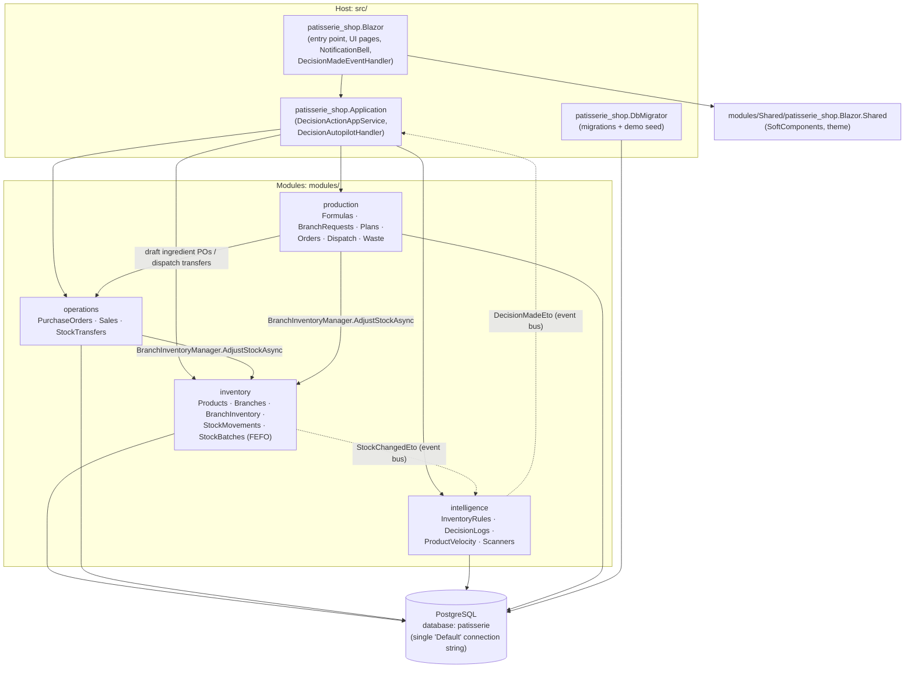
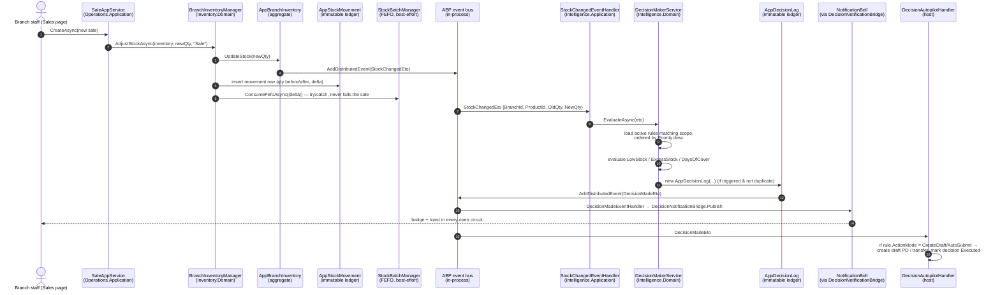
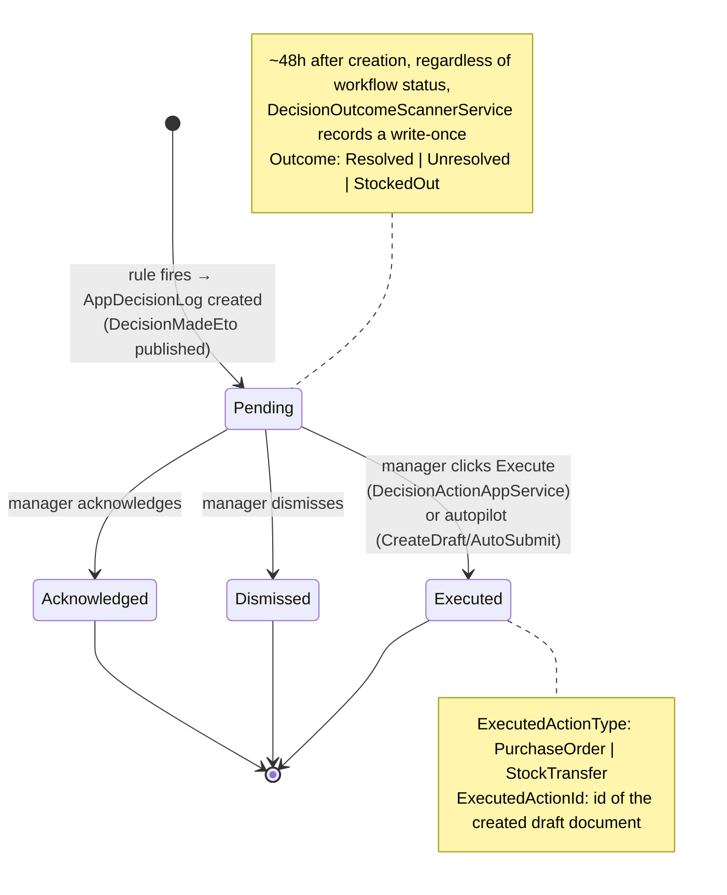
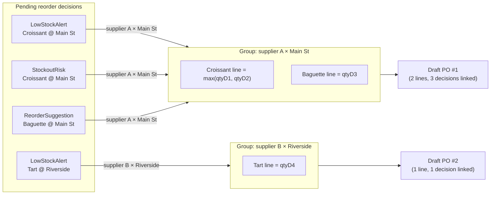

# Architecture

> Smart Multi-Branch Inventory Management System — Rule-Based Inventory Decision Support System.
> ABP Framework v10.1.1 · .NET 10 · Blazor Server · PostgreSQL · EF Core 10.

This document is the technical architecture reference for the thesis. Every type, file,
formula, and constant below is taken directly from the source code (file paths are given
relative to the repository root).

---

## 1. Modular Monolith Layout

The solution is a **modular monolith**: one process, one PostgreSQL database, four
domain modules plus a thin host application. Each module follows Clean/Onion layering
with ABP's rich domain model (entities with private setters and behavior methods,
domain services, custom repositories, thin application services).



Each module has the same internal layering:

| Layer | Contents | Example (inventory) |
|---|---|---|
| `Domain` | Entities, domain services (`*Manager`), repository interfaces | `AppProduct`, `BranchInventoryManager`, `IProductRepository` |
| `Domain.Shared` | ETOs, enums/constant classes, error codes, localization | `StockMovementTypes`, `InventoryErrorCodes` |
| `Application.Contracts` | DTOs, app-service interfaces, permission definitions | `ProductDto`, `IProductAppService`, `InventoryPermissions` |
| `Application` | App-service implementations, event handlers, Mapperly mappers | `ProductAppService`, `StockChangedEventHandler` (intelligence) |
| `EntityFrameworkCore` | DbContext, EF configuration, custom repositories | `InventoryDbContext`, `BranchInventoryRepository` |

Modules never reference each other's entities — **cross-aggregate and cross-module
references are by `Guid` id only**, and cross-module communication is either an app-service
interface call (host orchestration) or a distributed event.

---

## 2. The Event-Driven Core Loop

Everything in the intelligence pipeline starts from a single chokepoint:
`BranchInventoryManager.AdjustStockAsync`
(`modules/inventory/src/Inventory.Domain/BranchInventory/BranchInventoryManager.cs`).
Every sale, purchase receipt, transfer leg, and manual adjustment funnels through it.



Key event types (ETOs):

| ETO | Published by | Consumed by |
|---|---|---|
| `StockChangedEto` | `AppBranchInventory.UpdateStock()` (inside the aggregate) | `StockChangedEventHandler` → `DecisionMakerService` (intelligence) |
| `SaleRecordedEto` | `AppSale` aggregate | operations-side bookkeeping |
| `PurchaseReceivedEto` | `AppPurchaseOrder` aggregate | stock receipt bookkeeping |
| `TransferCompletedEto` | `AppStockTransfer` aggregate | transfer stock movement bookkeeping |
| `TransferStatusChangedEto` | `AppStockTransfer` aggregate (every workflow transition) | `TransferStatusChangedEventHandler` (UI bell bridge — "needs my action" refresh + hand-off toasts) |
| `DecisionMadeEto` | `AppDecisionLog` constructor | `DecisionMadeEventHandler` (UI bell bridge) and `DecisionAutopilotHandler` (autopilot) |

Events are **always published from aggregate methods**, never from application services.

### Real-time vs. scheduled evaluation

`DecisionMakerService.EvaluateAsync`
(`modules/intelligence/src/Intelligence.Domain/Services/DecisionMakerService.cs`) handles
only the rule types that can be judged from a single stock-change event: **LowStock**,
**ExcessStock**, and **DaysOfCover**. The DaysOfCover check uses the weekday-indexed
forecast walk (§6.3) — it reads the product×branch `AppProductVelocity` row and projects
the next days weekday-by-weekday, falling back to a flat 30-day average when the row has no
weekday pattern. **DeadStock**, **TransferSuggestion**, **ExpiringSoon**, and
**ExpiredStock** need cross-row or time-based context, so they are evaluated by periodic
background scanners (§5).

### Deduplication

Before creating a decision, `DecisionMakerService.TryCreateLogAsync` checks that
(a) the same decision type was not already raised in this evaluation pass, and
(b) **no `Pending` decision of the same `DecisionType` + `ProductId` + `BranchId` already
exists**. The background scanners apply the same pending-dedup (transfer suggestions
dedup on `ProductId` + `SourceBranchId` + `TargetBranchId`). This keeps the decision log
free of alert spam: a standing problem produces exactly one open decision.

---

## 3. Decision Lifecycle

`AppDecisionLog` (`modules/intelligence/src/Intelligence.Domain/Entities/AppDecisionLog.cs`)
is a `CreationAuditedAggregateRoot<Guid>` — an **immutable decision ledger** with exactly
two controlled mutations: a single workflow transition (`TransitionTo`) and a write-once
outcome (`RecordOutcome`).



- **Statuses** (`DecisionLogStatuses`): `Pending`, `Acknowledged`, `Dismissed`, `Executed`.
  The transition is one-shot — `TransitionTo` throws unless the current status is `Pending`.
- **Decision types** (`DecisionTypes`): `LowStockAlert`, `ExcessStockAlert`, `DeadStockFlag`,
  `TransferSuggestion`, `ReorderSuggestion`, `StockoutRisk` (raised by DaysOfCover rules),
  `ExpiryAlert` (raised by ExpiringSoon rules), `WasteWriteOff` (raised by ExpiredStock rules —
  human-only execution, see §4), plus the production-operation types
  `IngredientShortage`, `ProductionShortageRisk`, `HighKitchenWaste`,
  `ProductionCostVariance`, `LateProductionRisk`, and `UnfulfilledBranchRequest`.
- **Outcomes** (`DecisionOutcomes`): `Resolved`, `Unresolved`, `StockedOut` — recorded once,
  ~48 hours after creation (§6).
- Every decision stores its evidence: `RuleId`, `Reasoning` (human-readable sentence),
  `SuggestedAction`, `StockAtEvaluation`, `DaysWithoutSale`, and for transfers
  `SourceBranchId`/`TargetBranchId`.

---

## 4. Rules Engine

### Rule types (`InventoryRuleTypes`)

| RuleType | Threshold field | Meaning | Evaluated by |
|---|---|---|---|
| `LowStock` | `ThresholdValue` (units) | `NewQty < ThresholdValue` | `DecisionMakerService` (real time) |
| `ExcessStock` | `ThresholdValue` (units) | `NewQty > ThresholdValue` | `DecisionMakerService` (real time) |
| `DaysOfCover` | `ThresholdValue` (days) | `NewQty / AvgDailySales30 < ThresholdValue` | `DecisionMakerService` (real time) + `VelocityScannerService` (sweep) |
| `DeadStock` | `ThresholdDays` | days since `LastSoldDate ≥ ThresholdDays` | `DeadStockScannerService` (periodic) |
| `TransferSuggestion` | `ThresholdValue` (units) | one branch low, another in excess | `TransferSuggestionScannerService` (periodic) |
| `ExpiringSoon` | `ThresholdDays` | a live batch expires within `ThresholdDays` | `ExpiryScannerService` (periodic, pass 1) |
| `ExpiredStock` | *(none)* | a live batch is already **past** its expiry date | `ExpiryScannerService` (periodic, pass 2) |

Seven rule types in total. `InventoryRuleTypes.UsesThresholdDays` returns true only for
`DeadStock` and `ExpiringSoon`; `ExpiredStock` carries **no threshold at all**
(`UsesNoThreshold` returns true — "expired" is absolute, so both `ThresholdValue` and
`ThresholdDays` are forced null). An active `ExpiredStock` rule simply *enables*
write-off flagging for its scope.

### Rule scope matrix

`AppInventoryRule.ProductId` and `BranchId` are both nullable:

| `ProductId` | `BranchId` | Scope |
|---|---|---|
| null | null | Global — all products, all branches |
| set | null | This product in all branches |
| null | set | All products in this branch |
| set | set | This product in this branch |

`RuleScopeMatcher.MatchBestRule`
(`modules/intelligence/src/Intelligence.Application/Decisions/RuleScopeMatcher.cs`)
resolves conflicts with specificity precedence — **exact (product+branch) > product-only >
branch-only > global** — and within the candidate list, higher `Priority` wins (rules are
pre-sorted by `Priority` descending). Example from the seeded rule bank: "Critical Low
Stock Alert" (threshold 2, priority 10) overrides "Global Low Stock Alert" (threshold 5,
priority 0) whenever both match.

### Action modes (`RuleActionModes`) — the autopilot dial

Each rule carries an `ActionMode` that controls what happens the moment one of its
decisions is created (`DecisionAutopilotHandler`,
`src/patisserie_shop.Application/Decisions/DecisionAutopilotHandler.cs`, subscribed to
`DecisionMadeEto`):

| ActionMode | Behavior |
|---|---|
| `SuggestOnly` (default) | Nothing automatic. Decision stays `Pending` for a human. |
| `CreateDraft` | Autopilot immediately runs the same logic as the Execute button: creates the corrective **draft** document and marks the decision `Executed` with a link to it. |
| `AutoSubmit` | Same as `CreateDraft`, then submits the document for approval (PO `Draft → Submitted`). |

Which document gets created depends on the decision type:

| Decision type | Action created on Execute / autopilot |
|---|---|
| `LowStockAlert`, `ReorderSuggestion`, `StockoutRisk` | Draft **purchase order** to the product's default supplier (`ExecutedActionType = PurchaseOrder`) |
| `TransferSuggestion` | Draft **stock transfer** from source branch to target branch (`ExecutedActionType = StockTransfer`) |
| `WasteWriteOff` | A **`WriteOff` stock adjustment** of the currently-expired quantity (`ExecutedActionType = StockAdjustment`, `ExecutedActionId` null — the movement ledger is the trail). **Human-only — never autopilot.** |
| `ExcessStockAlert`, `DeadStockFlag`, `ExpiryAlert` | No document — decision is simply marked `Executed` |

The autopilot handler is failure-isolated (try/catch, never rethrows, so a failed
autopilot action cannot roll back the scanner/stock transaction) and re-entrancy safe
(executing a decision does not publish another `DecisionMadeEto`).

**`WasteWriteOff` is deliberately excluded from the autopilot's `createsDocument` set**
(`DecisionAutopilotHandler.RunAutopilotAsync`): executing it is destructive (stock leaves
the system through an irreversible `WriteOff` adjustment, not a draft a human later
approves), so it is always human-triggered from the decision log regardless of the rule's
`ActionMode`. `ExecuteWasteWriteOffAsync` re-reads the *currently* expired quantity from
the batch ledger at execution time (sales/transfers may have consumed expired batches
since the scan), clamps it to `QuantityOnHand` so ledger drift can't drive stock negative,
and adjusts down through the public `WriteOff` path — which appends the immutable movement
and drains expired batches first (§7).

---

## 5. Background Scanner Schedule

All scanners are `AsyncPeriodicBackgroundWorkerBase` workers registered in
`IntelligenceApplicationModule`
(`modules/intelligence/src/Intelligence.Application/IntelligenceApplicationModule.cs`).
Each reads its interval from configuration (`src/patisserie_shop.Blazor/appsettings.json`,
section `BackgroundJobs`) and falls back to a built-in default.

| Worker | Service | Produces | Config key (`BackgroundJobs:`) | Demo (`appsettings.json`) / built-in default |
|---|---|---|---|---|
| `DeadStockScannerWorker` | `DeadStockScannerService` | `DeadStockFlag` when `(today − LastSoldDate) ≥ ThresholdDays` | `DeadStockScanIntervalMinutes` | 2 / 1440 |
| `TransferSuggestionScannerWorker` | `TransferSuggestionScannerService` | `TransferSuggestion` pairing a low branch with an excess branch | `TransferSuggestionScanIntervalMinutes` | 2 / 1440 |
| `VelocityScannerWorker` | `VelocityScannerService` | **(1)** upserts `AppProductVelocity` (7/30-day velocity, revenue, ABC class **and the seven weekday demand indices**); **(2)** sweeps `StockoutRisk` against DaysOfCover rules using the forecast walk | `VelocityScanIntervalMinutes` | 2 / 1440 |
| `ExpiryScannerWorker` | `ExpiryScannerService` | **(1)** `ExpiryAlert` when a live batch (`QuantityRemaining > 0`) has `ExpiryDate ≤ today + ThresholdDays`; **(2)** `WasteWriteOff` for any live batch already **past** its expiry date | `ExpiryScanIntervalMinutes` | 2 / 1440 |
| `DecisionOutcomeScannerWorker` | `DecisionOutcomeScannerService` | write-once `Outcome` on decisions older than 48 h (max 500 per run) | `DecisionOutcomeScanIntervalMinutes` | 360 |

All scanner services live in `modules/intelligence/src/Intelligence.Application/Decisions/`.
Each interval reads from `src/patisserie_shop.Blazor/appsettings.json` (`BackgroundJobs`
section); the repo ships demo-friendly **2-minute** values, with `0` falling back to a
worker's built-in default (1440 / 360). ABP periodic workers fire their **first tick one
full interval after startup**.

Two scanners run as ordered multi-pass jobs:

- **`VelocityScannerService.ScanAsync`** computes velocity **before** the sweep, so the
  StockoutRisk pass reads tonight's numbers (and the freshly-computed weekday indices),
  not yesterday's. Weekday indices are derived from the trailing 30-day day-of-week sales
  distribution: `index[d] = (avg units sold on weekday d) ÷ (overall avg daily units)`,
  clamped to `[0, 5]`, Sunday-first; zero overall demand → all `1.0` (flat). The
  StockoutRisk forecast walk is capped at a 30-day horizon (`ForecastHorizonDays`) — stock
  that survives 30 forecast days is never alerted on even under a larger rule threshold.
- **`ExpiryScannerService.ScanAsync`** runs the `ExpiringSoon` pass first (alerts on
  soon-to-expire batches, grouped per product×branch, against the best-fit rule's
  `ThresholdDays`), then the `ExpiredStock` pass (already-past-expiry batches → a
  `WasteWriteOff` decision that quantifies the expired units, the oldest expiry, and the
  estimated waste cost = `expiredQty × CostPrice`). Both passes apply the same
  per-`(ProductId, BranchId)` Pending-dedup as the other scanners.

---

## 6. Formulas (all deterministic, all explainable)

### 6.1 Sales velocity (`VelocityScannerService`)

For every product × branch, over trailing sales windows:

```
AvgDailySales7  = QuantitySold7  / 7
AvgDailySales30 = QuantitySold30 / 30
```

### 6.2 ABC classification (`VelocityScannerService`)

Per **product globally** (revenue summed across all branches over 30 days), products are
sorted by revenue descending and classified by cumulative revenue share:

```
cumulative share ≤ 80%        → A
cumulative share ≤ 95%        → B
otherwise (or zero revenue)   → C
```

The class is stamped on every branch row of that product (`AppProductVelocity.AbcClass`).

### 6.3 Weekday-indexed forecast walk & days of cover

The system does **not** use a single flat `onHand / avgDaily` division for stockout risk;
it walks the next days **weekday by weekday**, weighting each day's demand by that
weekday's index. The math lives in the pure, deterministic, dependency-free
`ForecastWalker` (`modules/intelligence/src/Intelligence.Domain/Velocity/ForecastWalker.cs`),
shared by the nightly StockoutRisk sweep (`VelocityScannerService`), the real-time
`DecisionMakerService`, the reorder-calendar service, and the velocity read model — one
formula, three callers.

```
DailyDemand(day)        = AvgDailySales30 × weekdayIndex[(int)day]   (Sunday-first array)
DaysUntilDepletion:
    remaining = onHand
    for day = 1 .. horizon:                       // day 1 = tomorrow
        weekday   = (startDay + day − 1) mod 7
        remaining -= AvgDailySales30 × weekdayIndex[weekday]
        if remaining ≤ 0: return day               // 1-based depletion day
    return null                                     // survives the whole horizon
```

- `avgDaily ≤ 0` → `null` (no demand signal — dead stock is another scanner's job).
- `onHand ≤ 0` → `0` (already out).
- **Flat fallback:** `ForecastWalker.IsFlat` is true when all seven indices are `1.0`
  (no weekday pattern) or all `0` (unmigrated/uncomputed row). In that case callers fall
  back to the plain division `daysOfCover = QuantityOnHand / AvgDailySales30`, and the
  decision's reasoning string says so explicitly ("No weekday sales pattern — flat 30-day
  average used.").

A `DaysOfCover` rule fires a `StockoutRisk` decision when the walk depletes stock in
**fewer days than `ThresholdValue`** (threshold interpreted as days of cover; horizon
capped at 30 days in the sweep).

**Worked example.** Seeded rule "Days of Cover Risk (4 days)", threshold = 4. A croissant
with `AvgDailySales30 = 4` and 12 on hand, but a weekend-heavy pattern — say indices
`Fri 1.5, Sat 1.8, Sun 0.5` and the walk starting tomorrow on a Friday:

```
Day 1 (Fri): 12 − 4×1.5 = 6.0
Day 2 (Sat): 6.0 − 4×1.8 = −1.2  → depletes on day 2
```

`2 < 4` → `StockoutRisk` raised, two days *earlier* than the flat estimate (`12 / 4 = 3`
days) would have warned, because the weekend rush is front-loaded. `DescribeWeighting`
adds a human note to the reasoning, e.g. *"busiest Saturday ×1.80, quietest Sunday ×0.50"*.
The velocity read model also exposes a **`Next7DaysForecast`** = Σ of the next 7 days'
weekday-indexed demand, surfaced as the "Next 7 days" column on the Product Velocity page.

### Main Kitchen production formulas and shortage loop

The Production module keeps the thesis rule intact: production suggestions, ingredient
requirements, cost estimates, shortages, and waste alerts are deterministic arithmetic.
`AppProductionFormula` is a BOM-lite formula for one finished product. Its items store
ingredient product ids, integer base-unit quantities, and loss percentages. The pure
`ProductionCostCalculator` computes:

```
batches      = plannedOutput / formula.OutputQuantity
requiredQty  = ceil(batches × ingredientQty × (1 + lossPercent/100))
lineCost     = requiredQty × ingredientCostSnapshot
totalCost    = ingredientCost + laborCostPerBatch×batches + overheadCostPerBatch×batches
unitCost     = totalCost / plannedOutput
```

Production planning combines approved branch requests, the existing weekday demand
forecast, and Main Kitchen finished-goods stock:

```
SuggestedProductionQty = max(0, requestedQty + forecastQty - kitchenFinishedStock)
```

Confirmed plans create production orders. Each order snapshots the formula's ingredient
requirements and checks Main Kitchen on-hand quantities. If any line is short, the order
stays `WaitingForIngredients`; the Cook screen can create draft ingredient purchase
orders grouped by the ingredient's default supplier. Receiving those POs goes through the
normal purchase-order flow and the same `BranchInventoryManager.AdjustStockAsync`
chokepoint. Refreshing availability then moves the order to `ReadyToCook`.

Starting a cook consumes ingredients with stock movement type `ProductionConsumption`.
Completing it creates accepted finished goods with `ProductionOutput` and a batch expiry
date; rejected output is written to the append-only `ProductionWastes` ledger. Dispatch
uses the existing stock-transfer lifecycle from Main Kitchen to a sales branch, preserving
source batch expiry dates.

### 6.4 Reorder point (Execute → draft PO)

`DecisionActionAppService.ComputeReorderQuantity`
(`src/patisserie_shop.Application/Decisions/DecisionActionAppService.cs`).
With demand velocity (`AvgDailySales30 > 0`) and an **effective** lead time (see below):

```
coverDays = leadTimeDays + 7
safety    = ceil(avgDaily30 × 2)
target    = ceil(avgDaily30 × coverDays) + safety
order     = max(target − onHand, 1)
if MaximumStock is set: order = max(min(order, MaximumStock − onHand), 1)
```

**Worked example:** `avgDaily30 = 4.2`, effective lead time 3 days, 3 on hand, no max:
`coverDays = 10`, `safety = ceil(8.4) = 9`, `target = ceil(42) + 9 = 51`,
`order = 51 − 3 = 48`. The PO notes record exactly this, plus which lead time drove it:
`"ROP: 4.2/day × (3d lead + 7d cover) + 9 safety = 51 target − 3 on hand → order 48 (configured 3d lead)."`

**Measured lead time feeds back into the ROP (the learning loop).**
`ResolveEffectiveLeadTimeAsync` does not blindly use the supplier's *configured*
`LeadTimeDays`. It pulls the supplier's delivery history over the last
`LeadTimeWindowDays = 180` days via `IPurchaseOrderRepository.GetSupplierScorecardsAsync`
and, when at least `MinLeadTimeSampleSize = 3` received orders carry a delivery date, uses
the **measured average lead time** (`AvgActualLeadTimeDays`, the mean of
`ActualDeliveryDate − OrderDate` over received orders, rounded to whole days) instead. The
note then reads e.g. `(measured 4.2d lead from 6 orders)`. Below the 3-sample floor the
configured value is kept (a couple of deliveries is too noisy). So the system *observes*
how long a supplier actually takes and tightens its own reorder timing accordingly — no
ML, just measured history overriding a static config when there's enough of it.

This exact `ComputeReorderLineAsync` math is shared by both single-Execute and PO
consolidation (§8), so a consolidated line carries the same quantity it would as a one-off PO.

**Fallback** (no velocity row or zero 30-day velocity — "Phase 1 refill"):

```
order = MaximumStock − onHand                    (if a ceiling is set)
order = max(reorderLevel × 2 − onHand, reorderLevel)   (otherwise)
order = max(order, 1)
```

### 6.5 Transfer quantity (Execute → draft transfer)

`DecisionActionAppService.CreateDraftStockTransferAsync`:

```
targetDeficit = max(targetMin − targetQty, 0)
sourceSurplus = max(sourceQty − sourceMin, 0)
quantity      = min(max(targetDeficit, sourceSurplus / 2), sourceSurplus)
quantity      = max(quantity, 1)
```

Surplus is measured **above the source's own minimum stock**, so a transfer never drains
the source below its reorder level. The formula is written into the transfer notes.

### 6.6 Outcome grading (`DecisionOutcomeScannerService.EvaluateOutcome`)

48 hours after a decision is created (regardless of its workflow status), the scanner
re-reads the world and records a write-once outcome:

| Decision type | `StockedOut` | `Resolved` | `Unresolved` |
|---|---|---|---|
| `LowStockAlert` / `ReorderSuggestion` | qty = 0 | qty > rule threshold | otherwise (or rule deleted) |
| `StockoutRisk` | qty = 0 | days of cover > threshold, or demand evaporated (velocity ≤ 0) | otherwise |
| `TransferSuggestion` (judged at target branch) | qty = 0 | qty > threshold | otherwise |
| `ExcessStockAlert` | — (qty = 0 counts as Resolved) | qty ≤ threshold | otherwise |
| `DeadStockFlag` | — | a sale happened after the decision (`LastSoldDate > CreationTime`) | otherwise |
| `ExpiryAlert` | — | no live batch still inside the expiry window | otherwise |
| `WasteWriteOff` | — | no live batch still **past** its expiry date (the expired stock was written off / cleared) | otherwise |

### 6.7 Rule effectiveness & tuning hints

`IDecisionLogRepository.GetRuleEffectivenessAsync` aggregates, per rule, the workflow
counts (Pending / Acknowledged / Dismissed / Executed) and outcome counts (Resolved /
StockedOut), plus the strongest signal: **`DismissedThenStockedOut`** — decisions a manager
dismissed that nevertheless ended in a stockout. The Inventory Rules page
(`src/patisserie_shop.Blazor/Components/Pages/InventoryRules.razor`, `GetHint`) turns these
into deterministic tuning hints, strongest first:

| Condition | Hint |
|---|---|
| `DismissedThenStockedOut ≥ 2` | "Warning: dismissed alerts were followed by stockouts — alerts were warranted." |
| `TotalDecisions ≥ 10` and `Dismissed/Total ≥ 70%` | "Noisy: 70%+ of alerts dismissed — consider relaxing the threshold." |
| `Executed > 0` and `Resolved/Executed ≥ 80%` | "Effective: most executed decisions resolved." |

### 6.8 Supplier scorecards & grading

`SupplierScorecardAppService` (`src/patisserie_shop.Application/Suppliers/`) composes the
Operations PO delivery history with the Inventory supplier records into one scorecard per
supplier. All aggregation lives in `IPurchaseOrderRepository.GetSupplierScorecardsAsync`
(EF Core layer), which materializes the terminal orders (`Received` / `PartialReceived`)
in the window and computes the metrics in memory:

| Metric | Formula |
|---|---|
| On-time rate | `OnTimeOrders / (OnTimeOrders + LateOrders)`, where on-time = both delivery dates set and `Actual ≤ Expected` |
| Fill rate | `TotalReceivedQty / TotalOrderedQty` across the orders' line items |
| Avg delay | mean of `(ActualDeliveryDate − ExpectedDeliveryDate)` in days (negative = early), over orders with both dates |
| Measured lead time | mean of `(ActualDeliveryDate − OrderDate)` in days over received orders with a delivery date; `LeadTimeSampleSize` = how many such orders |

The **letter grade** (`SupplierGrading.Grade`) is the *worse* of the two bands — no
weighting curve, fully deterministic:

```
A — on-time ≥ 95% AND fill ≥ 98%
B — on-time ≥ 85% AND fill ≥ 95%
C — on-time ≥ 70% AND fill ≥ 90%
D — anything below C
N/A — either metric has no history
```

Scorecards are shown on `/inventory/suppliers`. The same `GetSupplierScorecardsAsync`
read-model is the source of the **measured lead time that overrides the configured
`LeadTimeDays` in the ROP formula** once there are ≥ 3 samples (§6.4) — measuring supplier
behavior and feeding it back into reorder timing is the learning loop on the procurement side.

### 6.9 Branch health score

`BranchHealthAppService` (`src/patisserie_shop.Application/Dashboard/`) composes one
explainable **0–100** score per branch from the same data the dashboards already
aggregate (pulled once cross-branch, grouped in memory — no per-branch N+1). Six weighted
components, each capped and floored, each carrying a human `Detail` string:

| Component | Weight | Formula |
|---|---|---|
| `StockHealth` | 30 | `round(30 × healthyFraction)`; healthy = rows that are not low, not out, not excess |
| `StockoutSeverity` | 20 | `max(0, 20 − 4 × outOfStockRows)` |
| `PendingLoad` | 15 | `max(0, 15 − 1 × max(0, pendingDecisions − 3))` (first 3 pending free) |
| `WasteRatio` | 15 | `round(15 × (1 − min(ratio × 10, 1)))`, `ratio = wasteCost / max(sales, 1)` over 30 days; 0% → 15, ≥10% → 0 |
| `ExpiryRisk` | 10 | `max(0, 10 − 2 × batchesExpiringWithin3Days)` |
| `Responsiveness` | 10 | `round(10 × actedFraction)` of decisions older than 48 h that are no longer Pending |

Score = sum of the six (max 100). **Grade:** `≥85 → A`, `≥70 → B`, `≥55 → C`, else `D`.
Branches are ranked into a **league table on the admin dashboard** (`AdminDashboard.razor`,
ordered by score desc then name); each row exposes the per-component breakdown bars.

---

## 7. FEFO Batch Tracking

Perishable products (`AppProduct.ShelfLifeDays` set) get a parallel **batch ledger**
(`AppStockBatch`, table `InventoryStockBatches`) maintained by `StockBatchManager` and
driven from the same `AdjustStockAsync` chokepoint
(`BranchInventoryManager.TrackBatchLedgerBestEffortAsync`):

- **Receipt** (`delta > 0`, perishable product): one batch of `delta` units is created with
  `ExpiryDate = utcToday + ShelfLifeDays` and a `SourceType` of `Purchase`, `TransferIn`,
  `Adjustment`, or `Seed`.
- **Consumption** (`delta < 0`): `ConsumeFefoAsync` drains `|delta|` units across the
  product+branch's batches **first-expired-first-out** — non-expired batches by earliest
  expiry first, then expired batches oldest first (supported by the composite index
  `IX_StockBatches_Branch_Product_Expiry`).
- **Waste write-off** (`delta < 0`, movement type `WriteOff`): the consumption order is
  **inverted** — `ConsumeFefoAsync(..., expiredFirst: true)` drains **expired batches
  first** (oldest expiry first), then the normal FEFO order. A write-off exists to clear
  dead stock, so it must remove the already-expired lots before touching sellable ones.
  `StockMovementTypes.WriteOff` always decrements; the immutable movement row is the audit
  trail (no draft document — see §4).
- **Known scope decision:** a `TransferIn` creates a *fresh* batch at the destination —
  the source batch's remaining age is not carried across branches, so transferred stock
  looks slightly fresher in the ledger than it really is.
- The entire batch update is **best-effort**: wrapped in try/catch and logged. A batch
  bookkeeping failure can never roll back the authoritative stock mutation (§10).

The Expiry scanner (§5) raises `ExpiryAlert` decisions from this ledger; the Stock Batches
page (`/inventory/stock-batches`) renders an expiry countdown chip per batch.

---

## 8. PO Consolidation

`DecisionActionAppService.ConsolidateReordersAsync`
(`src/patisserie_shop.Application/Decisions/DecisionActionAppService.cs`, "Consolidate
reorders" button on `/intelligence/decision-log`) turns many pending reorder decisions
into a few realistic purchase orders. Real purchasing batches lines onto one order per
supplier rather than cutting a PO per SKU.

It gathers the pending **reorder-type** decisions (`LowStockAlert`, `ReorderSuggestion`,
`StockoutRisk` — the only types that raise a draft PO), groups them by
**(default supplier × destination branch)**, and creates **one draft PO per group**.
Within a group, decisions for the **same product collapse to a single line at the maximum
computed quantity** (no double-ordering), and every contributing decision is marked
`Executed` and linked to the PO. Each line quantity is computed by the *same*
`ComputeReorderLineAsync` ROP/fallback math as a one-off Execute (§6.4), so consolidated
numbers match exactly. Decisions whose product has **no default supplier** are skipped and
counted (`SkippedNoSupplier`), never fatal to the batch. The result is **draft** POs a
human still approves.



---

## 9. Reorder Calendar

`ReorderCalendarAppService` (`src/patisserie_shop.Application/Planning/`,
page `/intelligence/reorder-calendar`) composes **three deterministic forward signals**
into one month of calendar events (Sunday-first 6-week grid, branch-scoped to the caller's
accessible branches):

| Layer | Source | Event date |
|---|---|---|
| **Predicted stockout** (`danger`) | velocity read-model + `ForecastWalker.DaysUntilDepletion` walk over the remaining horizon | `today + daysUntilDepletion` (skipped if it never depletes or velocity ≤ 0) |
| **Expiring batch** (`warn`) | live batches (`QuantityRemaining > 0`, active products) whose `ExpiryDate` lands in the grid window | the batch's expiry day |
| **Expected delivery** (`success`) | open POs (not `Cancelled`, not `Received`) with an `ExpectedDeliveryDate` in the window | that expected date |

Same-day ordering is stockouts → expiries → deliveries (most urgent first); the response
is capped at 500 events. This is a pure read-model — no persistence — built from the
existing velocity rows, batch ledger and PO table.

---

## 10. Design Decisions & Trade-offs

**Immutable ledgers (`AppStockMovement`, `AppDecisionLog`).**
Both inherit `CreationAuditedAggregateRoot<Guid>` — no modification audit, no soft delete,
no update/delete calls anywhere in the codebase. State is set in the constructor; the only
exceptions are the decision log's one-shot workflow transition and write-once outcome.
*Why:* the stock history and the decision history are the system's evidence base. The
effectiveness scoring in §6.7 is only trustworthy because past decisions cannot be edited.
*Cost:* corrections must be modeled as new compensating rows (e.g. a `ManualAdjustment`
movement), never as edits.

**A single stock chokepoint (`BranchInventoryManager.AdjustStockAsync`).**
Sales, PO receipts, both transfer legs, and manual adjustments all change stock through
one domain-service method that atomically: validates, mutates the aggregate (which raises
`StockChangedEto`), appends the movement ledger row, and maintains `LastRestockedDate` /
`LastSoldDate`. *Why:* one place to guarantee the invariant "no stock change without a
ledger row and an event" — the entire intelligence pipeline depends on never missing a
stock change. *Cost:* the chokepoint is a hot path; it stays thin and synchronous.

**Best-effort batch drift.**
The FEFO batch ledger is deliberately *advisory*: batch updates run after the
authoritative stock mutation inside a try/catch and may silently fail (logged as a
warning). `QuantityOnHand` on `AppBranchInventory` is the single source of truth;
`SUM(QuantityRemaining)` over batches may drift from it. *Why:* expiry intelligence should
never block or roll back a sale. *Cost:* batch quantities are approximately right, not
reconciled — acceptable for alerting, not for accounting.

**In-process event bus.**
The system uses ABP's distributed event bus with its default **local (in-process)**
implementation. Publishing is transactional with the unit of work, handlers run in the
same process, and the UI "real-time" path is an in-process singleton bridge
(`DecisionNotificationBridge` → `NotificationBell`), not SignalR. *Why:* a modular
monolith gets exactly-once, ordered, transaction-consistent eventing for free, and the
code is already written against the distributed-bus abstraction — swapping in RabbitMQ/
Kafka later is a configuration change, though the UI bridge would then need a real
push channel. *Cost:* no cross-instance fan-out today; the app is single-node.

**Deterministic rules over ML.**
The engine is pure if/else over explicit thresholds — no model, no training, no
probabilistic output. *Why:* (1) every decision carries a complete, human-readable
explanation (`Reasoning` + the formula in the document notes) that a non-technical
manager and a thesis committee can verify by hand; (2) behavior is reproducible — the
same inputs always produce the same decision, which makes the 48-hour outcome grading a
fair experiment; (3) the tuning loop stays human: the system *measures* rule quality
(§6.7) and *suggests* threshold changes, but a person changes the rule. *Cost:* the
system cannot discover patterns it was not told about (seasonality, cross-product
cannibalization); the forecast quality ceiling is the 30-day moving average. That
trade-off is the point of the project: decision *support*, explainable by design.

**One database, four module prefixes.**
All four modules share the `Default` PostgreSQL connection string; isolation is logical
(table prefixes `Inventory*`, `Operations*`, `Intelligence*`, `Production*`, separate DbContexts — see
[database.md](database.md)). *Why:* transactional consistency across the sale → stock →
decision chain without distributed transactions. *Cost:* modules can't scale their storage
independently — irrelevant at this system's scale.
