# Database Schema

One PostgreSQL database (`patisserie`, `Default` connection string) shared by all three
modules. Isolation is logical: each module configures its own tables with a module prefix
in its `*DbContextModelCreatingExtensions.cs`:

| Module | Prefix | EF configuration file |
|---|---|---|
| Inventory | `Inventory*` | `modules/inventory/src/Inventory.EntityFrameworkCore/EntityFrameworkCore/InventoryDbContextModelCreatingExtensions.cs` |
| Operations | `Operations*` | `modules/operations/src/Operations.EntityFrameworkCore/EntityFrameworkCore/OperationsDbContextModelCreatingExtensions.cs` |
| Intelligence | `Intelligence*` | `modules/intelligence/src/Intelligence.EntityFrameworkCore/EntityFrameworkCore/IntelligenceDbContextModelCreatingExtensions.cs` |

ABP's framework tables (`AbpUsers`, `AbpRoles`, …) coexist in the same database and are
omitted here; the only business link to them is `InventoryBranches.ManagerUserId → AbpUsers.Id`.

## ER Diagram (main business tables)

Solid lines are real parent→child foreign keys (cascade delete, child owned by the
aggregate root). All other relationships are **logical references by Guid only** — the
DDD rule "reference other aggregates by id" means EF defines no navigation property and
no FK constraint across aggregate (or module) boundaries; they are drawn here as
relationships for readability.

```mermaid
erDiagram
    %% ============ INVENTORY ============
    InventoryCategories {
        guid Id PK
        string Name
        string Description
        bool IsActive
    }
    InventorySuppliers {
        guid Id PK
        string Name
        string ContactPerson
        string Phone
        string Email
        int LeadTimeDays
        bool IsActive
    }
    InventoryProducts {
        guid Id PK
        guid CategoryId FK "logical"
        guid DefaultSupplierId FK "logical, nullable"
        string Name
        string SKU UK
        string Unit
        decimal CostPrice
        decimal SalePrice
        string Currency "char(3), default USD"
        int ReorderLevel
        int ShelfLifeDays "nullable; null = non-perishable"
        bool IsActive
    }
    InventoryBranches {
        guid Id PK
        string Name
        string Address
        guid ManagerUserId "nullable, AbpUsers.Id"
        bool IsActive
    }
    InventoryBranchInventories {
        guid Id PK
        guid BranchId FK "logical; UK(BranchId, ProductId)"
        guid ProductId FK "logical"
        int QuantityOnHand
        int MinimumStock
        int MaximumStock "nullable"
        datetime LastRestockedDate "nullable"
        datetime LastSoldDate "nullable"
        string ConcurrencyStamp
    }
    InventoryStockMovements {
        guid Id PK
        guid BranchId FK "logical, indexed"
        guid ProductId FK "logical, indexed"
        string MovementType "Purchase|Sale|TransferIn|TransferOut|ManualAdjustment"
        int Quantity "signed delta"
        int QuantityBefore
        int QuantityAfter
        guid ReferenceId "nullable, source document"
        string ReferenceType
        datetime CreationTime "indexed; IMMUTABLE row"
    }
    InventoryStockBatches {
        guid Id PK
        guid BranchId FK "logical"
        guid ProductId FK "logical"
        string BatchNumber
        date ExpiryDate "IX(Branch, Product, Expiry) for FEFO"
        int QuantityReceived
        int QuantityRemaining
        string SourceType "Purchase|TransferIn|Adjustment|Seed"
        guid SourceId "nullable"
    }

    %% ============ OPERATIONS ============
    OperationsPurchaseOrders {
        guid Id PK
        guid SupplierId FK "logical"
        guid DestBranchId FK "logical"
        string PONumber UK
        string Status "Draft|Submitted|Approved|PartialReceived|Received|Cancelled"
        datetime OrderDate
        datetime ExpectedDeliveryDate "nullable"
        datetime ActualDeliveryDate "nullable"
        decimal TotalAmount
        string Currency
        string Notes "carries auto-generated ROP math"
    }
    OperationsPurchaseOrderItems {
        guid Id PK
        guid PurchaseOrderId FK "owned child, cascade"
        guid ProductId FK "logical"
        int OrderedQuantity
        int ReceivedQuantity
        decimal UnitPrice
        decimal Subtotal
    }
    OperationsSales {
        guid Id PK
        guid BranchId FK "logical, indexed"
        string InvoiceNumber UK
        datetime SaleDate "indexed"
        decimal TotalAmount
        string Currency
    }
    OperationsSaleItems {
        guid Id PK
        guid SaleId FK "owned child, cascade"
        guid ProductId FK "logical"
        int Quantity
        decimal UnitPrice
        decimal Subtotal
    }
    OperationsStockTransfers {
        guid Id PK
        guid FromBranchId FK "logical"
        guid ToBranchId FK "logical"
        string Status "Draft|Pending|Approved|InTransit|Completed|Cancelled"
        datetime RequestedDate
        datetime ApprovedDate "nullable"
        datetime CompletedDate "nullable"
        guid RequestedByUserId "nullable"
        guid ApprovedByUserId "nullable"
    }
    OperationsStockTransferItems {
        guid Id PK
        guid StockTransferId FK "owned child, cascade"
        guid ProductId FK "logical"
        int RequestedQuantity
        int ApprovedQuantity "nullable"
        int TransferredQuantity "nullable"
    }

    %% ============ INTELLIGENCE ============
    IntelligenceInventoryRules {
        guid Id PK
        string RuleName
        string RuleType "LowStock|ExcessStock|DeadStock|TransferSuggestion|DaysOfCover|ExpiringSoon"
        guid ProductId FK "logical, nullable = all products"
        guid BranchId FK "logical, nullable = all branches"
        int ThresholdValue "nullable"
        int ThresholdDays "nullable"
        string SuggestedAction
        int Priority "higher wins"
        bool IsActive
        string ActionMode "SuggestOnly|CreateDraft|AutoSubmit"
    }
    IntelligenceDecisionLogs {
        guid Id PK
        guid RuleId FK "logical, indexed"
        guid ProductId FK "logical, indexed"
        guid BranchId FK "logical, nullable, indexed"
        guid SourceBranchId "nullable, transfers"
        guid TargetBranchId "nullable, transfers"
        string DecisionType "LowStockAlert|ExcessStockAlert|DeadStockFlag|TransferSuggestion|ReorderSuggestion|StockoutRisk|ExpiryAlert"
        string Reasoning "human-readable evidence"
        string SuggestedAction
        int StockAtEvaluation "nullable snapshot"
        int DaysWithoutSale "nullable snapshot"
        string Status "Pending|Acknowledged|Dismissed|Executed"
        datetime AcknowledgedAt "nullable"
        guid AcknowledgedByUserId "nullable"
        string ExecutedActionType "PurchaseOrder|StockTransfer, nullable"
        guid ExecutedActionId "nullable, created document"
        string Outcome "Resolved|Unresolved|StockedOut, write-once"
        datetime OutcomeEvaluatedAt "nullable"
        datetime CreationTime "IMMUTABLE row otherwise"
    }
    IntelligenceProductVelocities {
        guid Id PK
        guid ProductId FK "logical; UK(ProductId, BranchId)"
        guid BranchId FK "logical"
        decimal AvgDailySales7
        decimal AvgDailySales30
        int QuantitySold30
        decimal Revenue30
        string AbcClass "A|B|C"
        datetime ComputedAtUtc "upserted by VelocityScanner"
    }

    %% ---- aggregate ownership (real FKs, cascade delete) ----
    OperationsPurchaseOrders ||--o{ OperationsPurchaseOrderItems : "owns"
    OperationsSales ||--o{ OperationsSaleItems : "owns"
    OperationsStockTransfers ||--o{ OperationsStockTransferItems : "owns"

    %% ---- logical by-id references ----
    InventoryCategories ||--o{ InventoryProducts : "categorizes"
    InventorySuppliers ||--o{ InventoryProducts : "default supplier"
    InventoryBranches ||--o{ InventoryBranchInventories : "stocks"
    InventoryProducts ||--o{ InventoryBranchInventories : "stocked as"
    InventoryBranches ||--o{ InventoryStockMovements : "at"
    InventoryProducts ||--o{ InventoryStockMovements : "of"
    InventoryBranches ||--o{ InventoryStockBatches : "holds"
    InventoryProducts ||--o{ InventoryStockBatches : "batched as"
    InventorySuppliers ||--o{ OperationsPurchaseOrders : "supplies"
    InventoryBranches ||--o{ OperationsPurchaseOrders : "destination"
    InventoryBranches ||--o{ OperationsSales : "sells at"
    InventoryBranches ||--o{ OperationsStockTransfers : "from / to"
    IntelligenceInventoryRules ||--o{ IntelligenceDecisionLogs : "triggered"
    InventoryProducts ||--o{ IntelligenceDecisionLogs : "about"
    InventoryProducts ||--o{ IntelligenceProductVelocities : "measured"
    InventoryBranches ||--o{ IntelligenceProductVelocities : "per branch"
```

## Aggregate Ownership

| Aggregate root | Owned children (no repository, no own DbSet access) |
|---|---|
| `AppPurchaseOrder` | `AppPurchaseOrderItem` (`OperationsPurchaseOrderItems`) |
| `AppSale` | `AppSaleItem` (`OperationsSaleItems`) |
| `AppStockTransfer` | `AppStockTransferItem` (`OperationsStockTransferItems`) |

Children are reachable only through their root (`Items` collection) and are cascade-deleted
with it. Every other entity is its own aggregate root with its own repository.

## Immutability Rules

- **`InventoryStockMovements`** (`AppStockMovement`, `CreationAuditedAggregateRoot`):
  append-only audit ledger. Quantity fields are exposed through read-only backing fields;
  the code base never calls Update or Delete on it. Corrections are new compensating
  movements.
- **`IntelligenceDecisionLogs`** (`AppDecisionLog`, `CreationAuditedAggregateRoot`):
  append-only decision ledger with exactly two controlled mutations — a one-shot
  `Pending → Acknowledged|Dismissed|Executed` transition and a write-once `Outcome`
  recorded ~48 h later by the outcome scanner. All evidence fields (`Reasoning`,
  `StockAtEvaluation`, …) are fixed at construction.
- **`IntelligenceProductVelocities`** (`AppProductVelocity`): not an audit ledger but
  derived data — no audit fields, no soft delete; rows are upserted wholesale by the
  velocity scanner and unique per `(ProductId, BranchId)`.
- Everything else is soft-deleted (`FullAuditedAggregateRoot`) except
  `AppBranchInventory` and `AppStockBatch` (`AuditedAggregateRoot` — hard rows, no soft
  delete; the branch-inventory row additionally carries a `ConcurrencyStamp` used as an
  optimistic-concurrency token through `BranchInventoryManager.EnsureConcurrencyStamp`).

## Notable Indexes & Constraints

| Table | Index / constraint | Purpose |
|---|---|---|
| `InventoryProducts` | unique `SKU` | SKU uniqueness (enforced in `ProductManager` + DB) |
| `InventoryBranchInventories` | unique `(BranchId, ProductId)` | one stock row per product per branch |
| `InventoryStockMovements` | `BranchId`, `ProductId`, `CreationTime` | ledger queries / audit log paging |
| `InventoryStockBatches` | `(BranchId, ProductId, ExpiryDate)` + `ExpiryDate` | FEFO consumption and expiry scans |
| `OperationsPurchaseOrders` | unique `PONumber`; `Status`; `OrderDate` | lookups + pipeline dashboards |
| `OperationsSales` | unique `InvoiceNumber`; `BranchId`; `SaleDate` | sales history / velocity windows |
| `IntelligenceDecisionLogs` | `Status`, `DecisionType`, `ProductId`, `RuleId`, `BranchId` | pending-dedup checks and decision-log filters |
| `IntelligenceProductVelocities` | unique `(ProductId, BranchId)` | upsert target for the velocity scanner |
